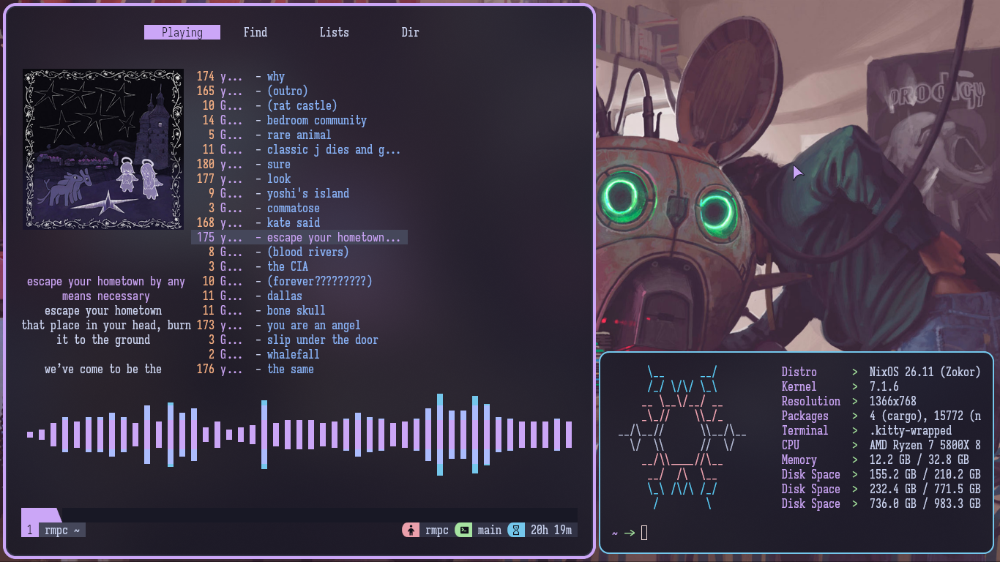
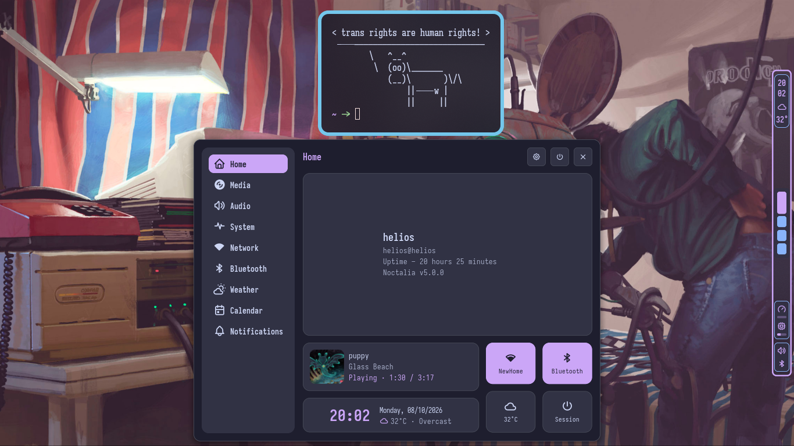
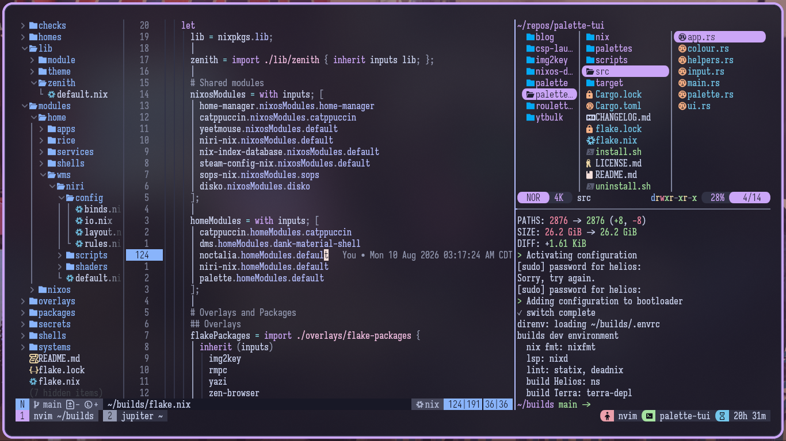
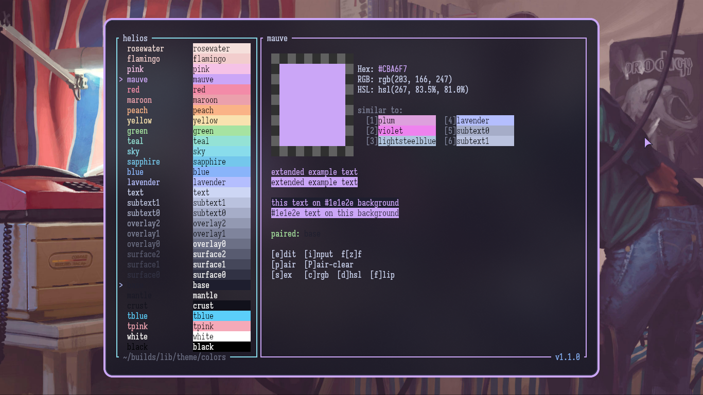
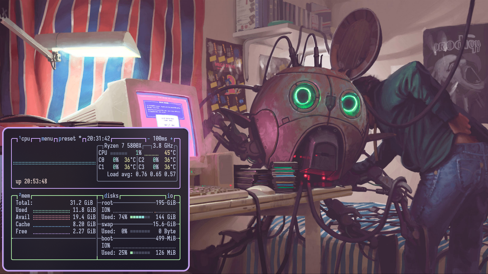

# The Solar System

Ive been told to write a readme, but i have no idea what to put here, so... heres the nix configs for my machines. One [flake](#flake-wiring), [two hosts](#machines): **helios** (my main pc) and **terra** (my server/laptop).
Dont expect this to be a "how do i install ur config", or a walkthrough for setting it up for yourself.
All this is gonna be, is me pointing you to the wiring, and my design philosophy in a way that helps you figure out how to rip out the parts you like for yourself.

> yes, im aware this looks insane. i just ripped snowfall-lib out entirely, and i wanted to keep a lot of the conveniences it provided me, so i wrote my own translation layer, `zenith`.

## Machines

| Host   | Role                  | Configuration                                                               |
| ------ | --------------------- | --------------------------------------------------------------------------- |
| helios | Desktop / workstation | - `systems/**/helios/default.nix`<br>- `homes/**/helios@helios/default.nix` |
| terra  | Home server           | - `systems/**/terra/default.nix`<br>- `homes/**/helios@terra/default.nix`   |

Helios has everything i use day to day, and is the canonical configuration point for
most modules. Unless something is unique to terra, it was configured around helios _first_,
then adapted to fit terra later

## Showcase

- My RMPC config, and macchina
  

- My bar+shell



- My terminal workflow/workspace with neovim, and yazi



## Repository layout

Where everything lives, and why:

- **`flake.nix`**:
  - Standard `inputs` structure, using `lib/zenith` in `outputs` to construct systems and `lib.custom`, and automatically import home/system modules in `modules/`.
    - Shared modules, overlays, and custom flake packages live in the `let ... in` block before `mkFlake`.
    - DevShells, and Checks live as imports inside the `mkFlake` block.<br>
      path: `(shells|checks)/**/default.nix`
- **`systems/x86_64-linux/<host>/`**:
  - NixOS config per machine:
    - `default.nix` - `configuration.nix` analogue
    - `disk.nix` - file system configuration for **helios only**
    - `disko.nix` - disko module configuration for **terra only**
    - `bootnet.nix` - boot and networking configurations
- **`homes/x86_64-linux/<user>@<host>/`**:
  - Home-Manager configs per machine.
    - `helios@helios` && `helios@terra`
- **`modules/nixos/`**:
  - System modules grouped by purpose:
    - `hardware/systems` - this is where the `hardware-configuration.nix` went,
    - `shared` - things that are 1:1 the same across both machines,
    - `gaming`, `security`, `services`, `virtualization`.
- **`modules/home/`**:
  - home modules grouped by purpose:
    - `apps`, `rice`, `services`, `shells`, `wms`.
- **`lib/`**:
  - The custom library has two parts, and 3 modules
  - Part 1: The builder
    - `lib/zenith` merges the two modules in part two
  - Part 2: The library
    - `lib/module` has module-writing helpers.
    - `lib/theme` holds colours and wallpapers.
    - Both are expressed as `lib.custom.<helper>`<br>
      _i.e `lib.custom.colors.helios.mauve.hex`_
- **`lib/theme/colors/*.json`**:
  - A json mapping of names and hex values, where each mapping contains just a hex value.
  - see [Colours](#colours-one-expression-one-palette-whole-machine), and [Palette-Tui](#palette-tui) for more info on how this ties into my config

```json
{
  "tblue": { "hex": "#5bcefa" },
  "tpink": { "hex": "#f5a9b8" },
  "white": { "hex": "#ffffff" }
}
```

- **`lib/theme/wallpapers/`**:
  - wallpaper images.
  - import all image files in this directory, and expose them as an
    attribute by the same name<br>
    _ie `lib.custom.wallpapers.tftf-11` refers to `lib/theme/wallpapers/tftf-11.jpg`_
- **`packages/`**:
  - custom packages defined in this repo.
- **`overlays/`**:
  - overlays that surface flake inputs as packages.
- **`shells/`**:
  - devShells:
    `default`, specifically for this config<br>
    `nix`, for any nix adjacent<br>
    `rust`, for any rust adjacent<br>
  - You can point direnv at these anywhere on your machine with `use flake /path/to/flake#rust`
- **`checks/`**:
  - flake checks.
- **`secrets/`**:
  - [sops-nix](https://github.com/Mic92/sops-nix) encrypted secrets.
- **`.assets/`**:
  - screenshots for this README.

## Flake wiring

- **flake-parts** assembles the flake.
  - **`zenith.mkSystem`** builds each machine. It pulls in the shared modules,
    the per-host config, and injects `lib.custom` into every module evaluation.
- **Auto-discovery**:
  - every `default.nix` under `modules/nixos/` and
    `modules/home/` is imported automatically.
  - Files with other names _must_ be imported manually.
- **Git is the visibility boundary**:
  - only git-tracked files exist to the flake.
  - Stage a new file with `git add` or it doesn't exist.

## Colours: one expression, one palette, whole machine

`lib/theme/default.nix` reads every JSON file in `lib/theme/colors/` and builds
`lib.custom.colors`, shaped as `colors.<palette>.<color>.<type>`.
ALL JSON files in `lib/theme/colors` are maps of `"name": {"hex": "value" }, ...`,
and we use `builtins` to convert the strings into their associated expressions.

- `<palette>` is the name of the json, without extension
  _ie: `gruvbox-dark.json` -> `colors.gruvbox-dark.<color>.<type>`._
  - `<color>` is the name of the colour object inside the json
    - `<type>` is the colour expression,
      ie `.hex`, `.rgb`, `.hsl`, or `.ansi`.
      - `.hex` is the raw hex value in the json <br>
        `.hex'` is that same value with no `#` <br>
        ie: `*.mauve.hex`=`"#cba6f7"` and `*.mauve.hex'`=`"cba6f7"`
      - `.rgb` uses `hexToRgb` to interpolate the `#RRGGBB` hex codes
        into 0-255 rgb values, `rgb(0,0,0)`
      - `.hsl` uses `hexToHsl` to interpolate the `#RRGGBB` hex codes
        into hsl percentages, `hsl(0,0%,0%)`
      - `.ansi` uses `hexToAnsi` and `hexToRgb` to turn `#RRGGBB` first
        into `rgb(0,0,0)`, then map those colours to an ansi escape sequence

Access a value like `colors.helios.surface1.hex`.

Palettes in the repo:

- **helios**: the active palette, used across the config
- **gruvbox-dark**: a spare palette, ready to swap in

Every consumer pulls from this one source. Kitty, Niri, the GTK theme, the
wallpaper, Btop, Cava, Noctalia, and more.
Change a hex value and the next rebuild rethemes the machine.

### palette-tui



The palette JSONs are maintained with **[palette-tui](https://github.com/Khitboksy/palette-tui)**, my Rust TUI (ratatui +
pastel). It browses, edits, and manipulates colour palettes stored as plain
JSON, and is designed to be the single source of truth for a system's colour
scheme. It can be used anywhere, but is _best_ used with NixOS due to the ability
to parse json natively.

#### Features:

- two-pane UI: palette list on the left, live preview on the right
- keyboard editing: RGB channels, hue rotation, lightness, saturation
- CIEDE2000 perceptual matching finds the nearest named colours and palette
  entries
- preview colour pairs to check contrast before you commit
- copy hex / RGB / HSL straight to the clipboard
- create palettes and add directories from inside the TUI
- Nix flake module: point it at a directory and every app themes off it

The config itself wires palette-tui straight to the repo:

```nix
# homes/x86_64-linux/helios@helios/default.nix
# options defined in modules/home/apps/term/tuis/palette/default.nix
{
  apps.term.tuis = {
    palette = {
      enable = true;
      default = {
        dir = "/home/helios/builds/lib/theme/colors";
        palette = "helios";
      };
      dirFormats = {
        "/home/helios/builds/lib/theme/colors" = [ "hex" ];
      };
    };
  };
}
```

## The rice

- **GTK theme**:
  - a custom "Helios" theme, generated in-repo. Its just catppuccin mocha, but i have
    adjusted what colours are where, so its not 1:1
- **Font**:
  - the repo ships a "Helios" font family (TTF and WOFF2 variants)
    _this is just Iosevka_
- **niri**:
  - custom GLSL shaders for window animations (the tile-drop effect)
- **Wallpaper**:
  - selected by name from `lib.custom.wallpapers`;
    change the reference and rebuild to swap it
    
- Supporting cast: kitty, cava, btop, rmpc, rofi, tmux, yazi, and neovim, all reading the
  same palette

## Installing

This is the loose version, on purpose. This config is complicated. Two
machines, sops secrets, disko, NFS mounts, a binary cache. Pretending it
is a plug-and-play template would be a lie. Take the ideas, not the files.

The rough shape, for context:

1. Clone the repo and make sure it evaluates: `nix flake check`
2. Partitioning is per-host: terra uses disko, helios uses a hand-written disk
   config. You will want your own.
3. Hardware configs are placeholders (`not-detected.nix`). You need your own.
4. Secrets are sops-encrypted. You need your own age keys, and you'll want to
   re-encrypt or drop the secrets.
5. Switch with `nh os switch --flake .#<host>` or
   `nixos-rebuild switch --flake .#<host>`.

Good luck.

## Development

- **devShells**: `nix develop .#default` (this config), `.#nix` (nix tooling),
  `.#rust` (Rust projects)
- **direnv/envrc** is set up, so entering the repo loads the default shell
- **checks**: `nix flake check` validates the config
